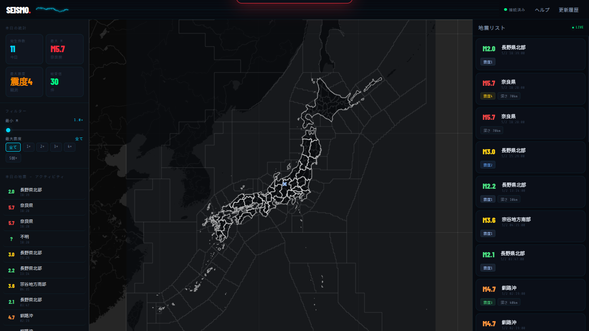

# Earthquake-Viewer v1.1.1

A high-performance earthquake monitoring and visualization tool for real-time acquisition and visual tracking of seismic activity.

[ [日本語](README_ja.md) | [English](README.md) ]



## Overview

Earthquake-Viewer is a web application that utilizes WebSockets to receive the latest earthquake reports instantly. It visualizes data through an interactive map and a detailed data list, featuring a high-visibility design inspired by a cyberpunk-dark aesthetic with dynamic Canvas animations.

## 🚀 Features

- **Real-time Synchronization**: Instant data updates via WebSocket connection (powered by P2P Earthquake Information JSON API).
- **Advanced Map Visualization**: 
  - Smooth map navigation and epicenter plotting with Leaflet.js.
  - High-precision rendering of **Seismic Intensity Sub-regions** and **Prefecture Boundaries**.
  - Optimized layer visibility for better tracking.
- **Dynamic Visuals**:
  - Real-time waveform Canvas animation in the header.
  - Adaptive UI colors that change based on the maximum seismic intensity of the reported quake.
- **Advanced Filtering**: Live data filtering based on seismic intensity, magnitude, depth, and epicentral area.
- **User Experience**: 
  - Built-in quick tutorial system for first-time users.
  - Detailed statistical panel tracking seismic trends and intensity distribution.
- **Responsive UI**: Designed to work seamlessly across browsers, including Chromebooks and mobile devices.

## 🛠 Tech Stack

- **Frontend**: HTML5 / CSS3 / JavaScript (Vanilla JS)
- **Map Engine**: [Leaflet.js](https://leafletjs.com/)
- **Data Source**: P2P Earthquake Information WebSocket API / Fetch API
- **Visualization**: HTML5 Canvas (Waveform), TopoJSON
- **Fonts**: Share Tech Mono, Barlow Condensed, Barlow (Google Fonts)

## 📦 Installation

Since this project consists of static files, it can be used immediately without any special server configuration.

1. Download or clone this repository.
2. Open `index.html` in your browser.
   - *Note: Using VS Code's `Live Server` extension is highly recommended for development.*

```bash
git clone https://github.com/cod-git12/Earthquake-Viewer.git
cd Earthquake-Viewer
# Open index.html in your browser
```

You can also view the live version at [GitHub Pages](https://cod-git12.github.io/Earthquake-Viewer).

## 📂 File Structure

- `index.html`: The main application entry point.
- `regionGeo_v2.js`: GeoJSON data for seismic intensity sub-regions.
- `prefectures.js`: GeoJSON data for Japanese prefecture boundaries.
- `cityCoords.js`: Data mapping for cities and regions.
- `preview.html`: Experimental version for ongoing development.

## 📄 License

This project is licensed under the **Apache License 2.0**.\
See the [LICENSE](LICENSE) file or the [Apache 2.0 Official Text](https://www.apache.org/licenses/LICENSE-2.0) for details.

## ⚠️ Disclaimer

- An active internet connection is required to load map tiles and boundary data.
- While the information is based on official data (JMA, etc.), network latency or API constraints may cause delivery delays.
- This application is intended for visualization and verification purposes; please do not use it as a substitute for official Earthquake Early Warnings.