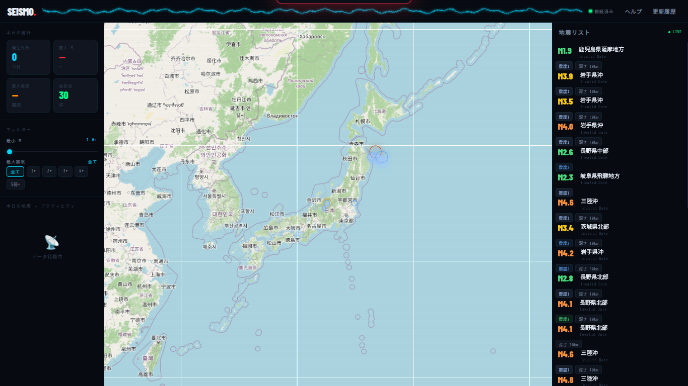

# Earthquake-Viewer v1.0.1

最新の地震情報をリアルタイムで取得・視覚化する、高機能な地震モニターツールです。

[ [日本語](README_ja.md) | [English](README.md) ]



## 概要

Earthquake-Viewerは、WebSocketを利用して最新の地震速報を即座に受信し、インタラクティブなマップと詳細なデータリストで表示するWebアプリケーションです。サイバーパンク・ダークを基調とした視認性の高いデザインを採用しています。

## 🚀 主な機能

- **リアルタイム同期**: WebSocket接続により、地震発生とほぼ同時に情報を更新。
- **インタラクティブマップ**: Leaflet.jsを使用したスムーズな地図操作と、震源地のプロット表示。
- **データフィルタリング**: 震度、マグニチュード、深さなどに基づく高度な絞り込み機能。
- **統計表示**: 直近の地震発生傾向を自動で集計し、グラフや統計パネルで表示。
- **ダークUI**: 情報密度を高めつつ、目に優しいモダンなダークテーマ。

## 🛠 技術構成

- **HTML5 / CSS3 / JavaScript (Vanilla JS)**
- **Map Engine**: [Leaflet.js](https://leafletjs.com/)
- **API/Data**: P2P地震情報などの公開API（WebSocket/Fetch）
- **Fonts**: Share Tech Mono, Barlow Condensed (Google Fonts)

## 📦 導入方法

このプロジェクトは静的ファイルのみで構成されているため、特別なサーバー設定なしですぐに使用できます。

1. このリポジトリをダウンロードまたはクローンします。
2. `index.html` をブラウザで開きます。
   - ※ 開発環境として VS Code の `Live Server` などの利用を推奨します。

```bash
git clone https://github.com/cod-git12/Earthquake-Viewer.git
cd Earthquake-Viewer
# ブラウザで index.html を開く
```

## 📄 ライセンス
このプロジェクトは Apache License 2.0 の下で公開されています。
詳細は [LICENSE](LICENSE) ファイルまたは [Apache 2.0](https://www.apache.org/licenses/LICENSE-2.0)の条文を参照してください。

## ⚠️ 注意事項
- 地図データの読み込みにはインターネット接続が必要です。
- 本ツールに表示される情報は、気象庁等の公的な情報を元にしていますが、ネットワークの遅延等により情報の到達時間に差異が生じる場合があります。