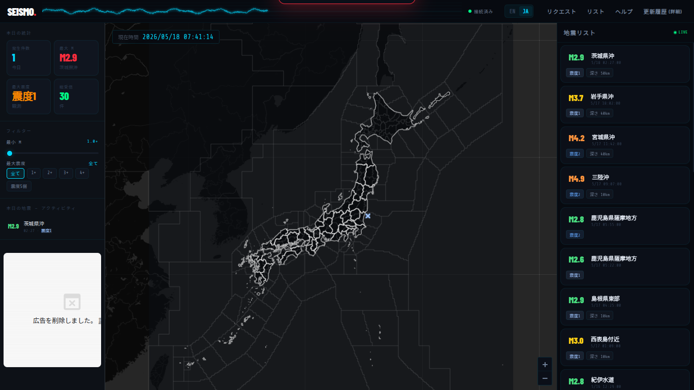

# SEISMO — Earthquake Monitor v2.5.0

最新の地震情報をリアルタイムで取得・視覚化し、ユーザーからのフィードバックを安全に管理できる高機能な地震モニターツールです。
GitHub Pages版（旧バージョン）から移行し、専用ドメインでの運用とSupabaseをバックエンドに備えた堅牢なシステムへ進化しました。

[ [日本語](README_ja.md) | [English](README.md) ]



## 概要

SEISMO（旧名: Earthquake-Viewer）は、WebSocketを利用して最新の地震速報を即座に受信し、インタラクティブなマップと詳細なデータリストで表示するWebアプリケーションです。サイバーパンク・ダークを基調とした洗練されたデザインに、Canvasアニメーションや動的な統計機能を備えています。

本バージョンからは、マップの精度を向上させるための「ユーザー参加型・未登録地点リクエスト機能」が追加され、管理画面はSupabase AuthenticationおよびRLS（Row Level Security）によって最高峰のセキュリティで保護されています。

## 🚀 主な機能

- **リアルタイム同期**: WebSocket接続により、地震発生とほぼ同時に情報を更新（P2P地震情報 JSON APIを使用）。
- **高度なマップ表示**: 
  - Leaflet.jsによる震源プロット。
  - **細分区域（震央地名）**および**都道府県境界**の精密な境界線描画。
  - 安全な文字列エスケープ（サニタイズ）を維持しつつ、Changelog（更新履歴）内で安全なカスタム `<link>` タグを展開する動的HTMLリンク機能。
- **データフィルタリング**: 震度、マグニチュード、深さなどに基づくリアルタイム絞り込み機能。
- **ユーザー体験 & 動的ビジュアル**:
  - ヘッダーでの波形Canvasアニメーション。
  - 最大震度に応じた動的なUIカラーチェンジ。
  - 初回起動時のクイックチュートリアル機能。
  - 詳細な統計パネル（震度分布、深さ別傾向など）。
- **ユーザー参加型リクエストエコシステム（NEW）**:
  - `request.html`: ユーザーがマップに反映されていない未登録の地点や震度観測点、補足情報を多言語（日・英）で申請できるフォーム。
  - `status.html`: 送信されたリクエストの進捗をリアルタイムに確認できる公開ステータス画面（PENDING / RESOLVED）。
  - `admin.html`: 管理者専用のダッシュボード。Supabaseのセッション管理と連動し、ワンクリックでリクエストの承認・保留切り替え、または削除が可能。

## 🛡 セキュリティ構成

フロントエンドのフェイクログイン（DevToolsによるクラス操作等）を完全にシャットアウトするため、バックエンドのデータベース（Supabase）と強固に連携しています。

- **Supabase Auth (JWTトークン認証)**: 管理者アカウントでのみ安全にセッションを確立。ログイン成功時にブラウザへセッション用の暗号化トークン（`sb-access-token`）を発行。
- **RLS (Row Level Security) による厳格な通信保護**:
  - 外部の第三者によるDevToolsコンソールからの直接的なデータ書き換え・不正な `PATCH` / `DELETE` リクエストを一律で自動ブロック。
  - 一般ユーザー（`anon` ロール）には `INSERT`（リクエスト送信）と `SELECT`（ステータス閲覧）のみを許可。
  - ログイン済みの管理者（`authenticated` ロール）にのみ、すべてのデータ操作（`ALL`）を許可。

## 🛠 技術構成

- **Frontend**: HTML5 / CSS3 / JavaScript (Vanilla JS)
- **Map Engine**: [Leaflet.js](https://leafletjs.com/)
- **Backend / Database**: [Supabase](https://supabase.com/) (PostgreSQL / Supabase Auth / RLS)
- **Data Source**: P2P地震情報 WebSocket API / Fetch API
- **Visuals**: HTML5 Canvas (Waveform Animation), TopoJSON
- **Fonts**: Share Tech Mono, Barlow Condensed, Barlow (Google Fonts)

## 📂 ファイル構成

- `index.html`: メインアプリケーション（地震モニター画面）
- `script.js`: メインアプリケーション（スクリプト部分）
- `style.css`: メインアプリケーション（スタイル部分）
- `request.html`: 一般ユーザー用・未登録地点リクエスト送信フォーム
- `status.html`: 一般ユーザー用・リクエスト進捗状況ステータス画面
- `admin.html`: 管理者専用・ログイン付きリクエスト管理ダッシュボード
- `regionGeo.js`: 震央地名（細分区域）のGeoJSONデータ
- `prefectures.js`: 都道府県境界のGeoJSONデータ
- `cityCoords.js`: 地域・都市マッピングデータ

## 📦 開発環境での導入方法

本アプリケーションは、高速かつ安定したホスティング環境である専用ドメイン（ `https://earthquake.5kaideta.cfd` ）で運用されています。ローカル環境で検証・開発を行う場合は、以下の手順に従ってください。

1. このリポジトリをダウンロードまたはクローンします。
2. `admin.html`, `request.html`, `status.html` 内の `SB_URL` および `SB_KEY` がご自身のSupabaseプロジェクトのものに設定されているか確認します。
3. プロジェクトルートでブラウザから各HTMLを開きます（VS Codeの `Live Server` 等のローカルサーバー環境の利用を推奨）。

```bash
git clone https://github.com/cod-git12/Earthquake-Viewer.git
cd Earthquake-Viewer
# 任意のローカルサーバーで index.html を起動
```

## 📄 ライセンス

このプロジェクトは **Apache License 2.0** の下で公開されています。\
詳細は [LICENSE](LICENSE) ファイルまたは [Apache 2.0](https://www.apache.org/licenses/LICENSE-2.0) の条文を参照してください。

## ⚠️ 注意事項

- 地図データ、境界線データの描画、およびリクエストシステムの同期にはインターネット接続が必要です。
- 本ツールに表示される情報は気象庁等の公的な情報を元にしていますが、ネットワークの遅延やAPIの仕様により、実際の情報到達時間と差異が生じる場合があります。緊急地震速報の代用としてではなく、情報の視覚化・確認用としてご利用ください。